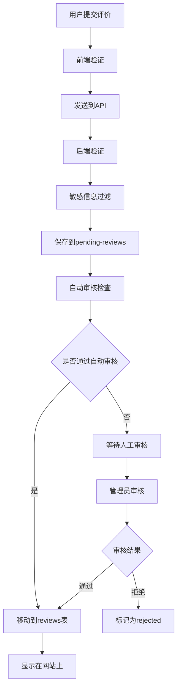

# 数据存储架构说明

## 概述

UW Date 平台支持多种数据存储方案，从简单的本地存储到完整的数据库解决方案。

## 存储方案

### 1. 文件存储（当前实现）

**适用场景**: 演示、小规模使用、快速部署

**存储结构**:
```
data/
├── reviews.json          # 已审核通过的评价
├── pending-reviews.json  # 待审核的评价  
├── reports.json          # 举报记录
└── stats.json           # 统计数据
```

**优点**:
- 无需数据库配置
- 部署简单
- 数据可视化和备份容易

**缺点**:
- 并发性能有限
- 不适合高流量
- 缺乏事务支持

### 2. SQLite 数据库

**适用场景**: 中小规模部署

**数据库结构**:
```sql
-- 用户表（可选，用于身份验证）
CREATE TABLE users (
    id INTEGER PRIMARY KEY AUTOINCREMENT,
    email VARCHAR(255) UNIQUE,
    password_hash VARCHAR(255),
    created_at DATETIME DEFAULT CURRENT_TIMESTAMP
);

-- 评价表
CREATE TABLE reviews (
    id VARCHAR(36) PRIMARY KEY,
    status VARCHAR(20) DEFAULT 'pending',
    
    -- 提交者信息
    reviewer_name VARCHAR(100) NOT NULL,
    reviewer_email VARCHAR(255),
    reviewer_ip VARCHAR(45),
    
    -- 被评价者信息
    target_name VARCHAR(100) NOT NULL,
    target_display_name VARCHAR(100) NOT NULL,
    target_program VARCHAR(50),
    
    -- 关系信息
    relationship_type VARCHAR(50) NOT NULL,
    relationship_duration VARCHAR(50),
    
    -- 评价内容
    content TEXT NOT NULL,
    original_content TEXT NOT NULL,
    tags TEXT, -- JSON array
    
    -- 时间戳
    submitted_at DATETIME DEFAULT CURRENT_TIMESTAMP,
    approved_at DATETIME,
    
    -- 审核信息
    approved_by VARCHAR(100),
    rejection_reason TEXT
);

-- 证据文件表
CREATE TABLE evidence_files (
    id INTEGER PRIMARY KEY AUTOINCREMENT,
    review_id VARCHAR(36) NOT NULL,
    filename VARCHAR(255) NOT NULL,
    original_name VARCHAR(255) NOT NULL,
    file_size INTEGER,
    uploaded_at DATETIME DEFAULT CURRENT_TIMESTAMP,
    FOREIGN KEY (review_id) REFERENCES reviews(id) ON DELETE CASCADE
);

-- 举报表
CREATE TABLE reports (
    id VARCHAR(36) PRIMARY KEY,
    review_id VARCHAR(36) NOT NULL,
    reason VARCHAR(100) NOT NULL,
    details TEXT,
    reporter_email VARCHAR(255),
    reporter_ip VARCHAR(45),
    status VARCHAR(20) DEFAULT 'pending',
    reported_at DATETIME DEFAULT CURRENT_TIMESTAMP,
    resolved_at DATETIME,
    FOREIGN KEY (review_id) REFERENCES reviews(id) ON DELETE CASCADE
);

-- 索引优化
CREATE INDEX idx_reviews_status ON reviews(status);
CREATE INDEX idx_reviews_target_name ON reviews(target_name);
CREATE INDEX idx_reviews_submitted_at ON reviews(submitted_at);
CREATE INDEX idx_reports_status ON reports(status);
```

### 3. PostgreSQL 数据库（推荐生产环境）

**适用场景**: 大规模部署、高并发

**配置示例**:
```javascript
// database/postgres.js
const { Pool } = require('pg');

const pool = new Pool({
    user: process.env.DB_USER || 'uwdate',
    host: process.env.DB_HOST || 'localhost',
    database: process.env.DB_NAME || 'uwdate_db',
    password: process.env.DB_PASSWORD,
    port: process.env.DB_PORT || 5432,
    ssl: process.env.NODE_ENV === 'production' ? { rejectUnauthorized: false } : false
});

module.exports = pool;
```

**数据库设置**:
```sql
-- 创建数据库
CREATE DATABASE uwdate_db;

-- 创建用户
CREATE USER uwdate WITH PASSWORD 'secure_password';
GRANT ALL PRIVILEGES ON DATABASE uwdate_db TO uwdate;

-- 使用数据库
\c uwdate_db

-- 创建表结构（同SQLite，但有增强功能）
CREATE EXTENSION IF NOT EXISTS "uuid-ossp";

CREATE TABLE reviews (
    id UUID PRIMARY KEY DEFAULT uuid_generate_v4(),
    status review_status DEFAULT 'pending',
    
    -- 提交者信息
    reviewer_name VARCHAR(100) NOT NULL,
    reviewer_email VARCHAR(255),
    reviewer_ip INET,
    
    -- 被评价者信息  
    target_name VARCHAR(100) NOT NULL,
    target_display_name VARCHAR(100) NOT NULL,
    target_program VARCHAR(50),
    
    -- 关系信息
    relationship_type VARCHAR(50) NOT NULL,
    relationship_duration VARCHAR(50),
    
    -- 评价内容
    content TEXT NOT NULL,
    original_content TEXT NOT NULL,
    tags JSONB, -- 使用JSONB以便搜索
    
    -- 时间戳
    submitted_at TIMESTAMPTZ DEFAULT NOW(),
    approved_at TIMESTAMPTZ,
    
    -- 审核信息
    approved_by VARCHAR(100),
    rejection_reason TEXT,
    
    -- 搜索优化
    search_vector tsvector
);

-- 创建枚举类型
CREATE TYPE review_status AS ENUM ('pending', 'approved', 'rejected');
CREATE TYPE report_status AS ENUM ('pending', 'resolved', 'dismissed');

-- 全文搜索索引
CREATE INDEX idx_reviews_search ON reviews USING GIN(search_vector);
CREATE INDEX idx_reviews_tags ON reviews USING GIN(tags);

-- 更新搜索向量的触发器
CREATE OR REPLACE FUNCTION update_search_vector()
RETURNS TRIGGER AS $$
BEGIN
    NEW.search_vector := 
        setweight(to_tsvector('simple', COALESCE(NEW.target_name, '')), 'A') ||
        setweight(to_tsvector('simple', COALESCE(NEW.content, '')), 'B') ||
        setweight(to_tsvector('simple', COALESCE(NEW.target_program, '')), 'C');
    RETURN NEW;
END;
$$ LANGUAGE plpgsql;

CREATE TRIGGER update_reviews_search_vector
    BEFORE INSERT OR UPDATE ON reviews
    FOR EACH ROW EXECUTE FUNCTION update_search_vector();
```

## 数据流程

### 1. 评价提交流程



### 2. 数据隐私处理

```javascript
// 隐私保护函数示例
function processReviewForStorage(rawReview) {
    return {
        ...rawReview,
        
        // 姓名隐私化
        target_display_name: maskName(rawReview.target_name),
        
        // 内容脱敏
        content: sanitizeContent(rawReview.content),
        original_content: rawReview.content, // 保留原文用于审核
        
        // 移除IP地址等敏感信息（仅用于审核）
        reviewer_ip: hashIP(rawReview.reviewer_ip),
        
        // 时间戳
        submitted_at: new Date().toISOString()
    };
}

function maskName(name) {
    if (!name || name.length < 2) return name;
    if (name.length === 2) return name[0] + '*';
    if (name.length === 3) return name[0] + '**';
    return name[0] + '*'.repeat(name.length - 2) + name[name.length - 1];
}

function sanitizeContent(content) {
    return content
        .replace(/\b\d{3}-\d{3}-\d{4}\b/g, '[电话已隐藏]')
        .replace(/\b[A-Za-z0-9._%+-]+@[A-Za-z0-9.-]+\.[A-Z|a-z]{2,}\b/g, '[邮箱已隐藏]')
        .replace(/\b\d{4}\s?\d{4}\s?\d{4}\s?\d{4}\b/g, '[卡号已隐藏]');
}
```

## 部署配置

### 环境变量

```bash
# .env 文件
NODE_ENV=production
PORT=3001

# 数据库配置
DB_TYPE=postgres  # 或 sqlite, file
DB_HOST=localhost
DB_PORT=5432
DB_NAME=uwdate_db
DB_USER=uwdate
DB_PASSWORD=your_secure_password

# 文件存储
UPLOAD_DIR=uploads
MAX_FILE_SIZE=10485760  # 10MB

# 安全配置
JWT_SECRET=your_jwt_secret
BCRYPT_ROUNDS=12

# 邮件配置（可选）
SMTP_HOST=smtp.gmail.com
SMTP_PORT=587
SMTP_USER=your_email@gmail.com
SMTP_PASS=your_app_password
```

### Docker 部署

```dockerfile
# Dockerfile
FROM node:18-alpine

WORKDIR /app

COPY package*.json ./
RUN npm ci --only=production

COPY . .

EXPOSE 3001

CMD ["npm", "start"]
```

```yaml
# docker-compose.yml
version: '3.8'

services:
  uwdate-api:
    build: .
    ports:
      - "3001:3001"
    environment:
      - NODE_ENV=production
      - DB_TYPE=postgres
      - DB_HOST=db
      - DB_NAME=uwdate_db
      - DB_USER=uwdate
      - DB_PASSWORD=secure_password
    depends_on:
      - db
    volumes:
      - ./uploads:/app/uploads
      - ./data:/app/data

  db:
    image: postgres:15-alpine
    environment:
      - POSTGRES_DB=uwdate_db
      - POSTGRES_USER=uwdate
      - POSTGRES_PASSWORD=secure_password
    volumes:
      - postgres_data:/var/lib/postgresql/data
    ports:
      - "5432:5432"

volumes:
  postgres_data:
```

## 数据备份和恢复

### 文件存储备份
```bash
# 备份
tar -czf uwdate-backup-$(date +%Y%m%d).tar.gz data/ uploads/

# 恢复
tar -xzf uwdate-backup-20250115.tar.gz
```

### PostgreSQL 备份
```bash
# 备份
pg_dump -h localhost -U uwdate uwdate_db > uwdate_backup_$(date +%Y%m%d).sql

# 恢复
psql -h localhost -U uwdate uwdate_db < uwdate_backup_20250115.sql
```

## 性能优化

### 数据库优化
1. **索引策略**: 为常用查询字段创建索引
2. **连接池**: 使用连接池管理数据库连接
3. **查询优化**: 使用EXPLAIN分析和优化查询
4. **分页**: 实现分页以处理大量数据

### 缓存策略
```javascript
// Redis 缓存示例
const redis = require('redis');
const client = redis.createClient();

async function getCachedReviews(cacheKey) {
    const cached = await client.get(cacheKey);
    if (cached) {
        return JSON.parse(cached);
    }
    
    const reviews = await getReviewsFromDB();
    await client.setex(cacheKey, 300, JSON.stringify(reviews)); // 5分钟缓存
    return reviews;
}
```

## 监控和日志

### 日志记录
```javascript
const winston = require('winston');

const logger = winston.createLogger({
    level: 'info',
    format: winston.format.combine(
        winston.format.timestamp(),
        winston.format.json()
    ),
    transports: [
        new winston.transports.File({ filename: 'logs/error.log', level: 'error' }),
        new winston.transports.File({ filename: 'logs/combined.log' })
    ]
});
```

### 数据库监控
- 连接数监控
- 查询性能监控  
- 存储空间监控
- 备份状态监控

## 安全考虑

1. **数据加密**: 敏感数据加密存储
2. **访问控制**: 实现适当的访问权限
3. **SQL注入防护**: 使用参数化查询
4. **数据备份**: 定期备份和恢复测试
5. **审计日志**: 记录所有数据操作

这个架构为UW Date平台提供了从简单到复杂的多种数据存储选择，可以根据实际需求和规模选择合适的方案。
